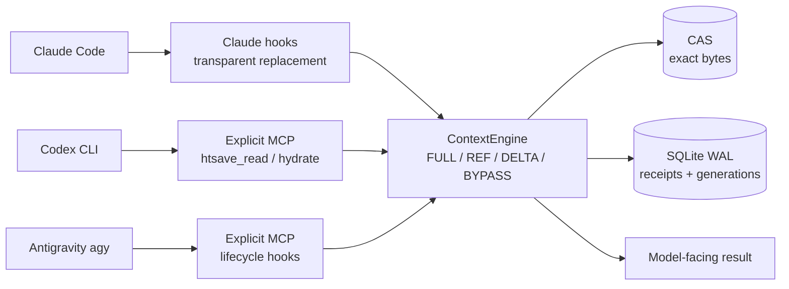

<!-- Language Switch -->
<p align="center">
  <strong>🌐 English</strong> |
  <a href="README.zh-TW.md">繁體中文</a>
</p>

---

# htsave

`htsave` 1.0.0 is a local, deterministic, lossless repeated-context layer for
Claude Code, Codex CLI, and Antigravity agy. It stores exact UTF-8 tool results
once per session and can return a confirmed reference or a verified
`unified-diff-v1` delta. It never normalizes bytes, summarizes content, performs
semantic/embedding search, or sends telemetry. agy is supported as an explicit
MCP integration, but its current live savings gate is red and carries no savings
claim.

The package is versioned 1.0.0. The remaining v1 release evidence is tracked in
[docs/release-gates.md](docs/release-gates.md); this repository should not be
treated as a completed v1 release until those gates are green.

On Claude Code it saves tokens transparently: repeat a command and its output
comes back as a reference instead of the full text, with nothing to change in
how you work. On Codex CLI only the explicit MCP tools save tokens, because
Codex has no supported way to replace a tool result. On agy, the same explicit
MCP tools are available alongside fail-open lifecycle hooks.

## At a glance

`htsave` intercepts repeated context at the host boundary. The first result is
stored as exact bytes; later results become a compact `REF` or a verified
`DELTA`, while `htsave_hydrate` can restore the original bytes exactly.



### Supported host matrix

| Host | Install | Model-facing path | Transparent replacement | Current evidence |
| :--- | :--- | :--- | :---: | :--- |
| **Claude Code** | `htsave claude install` | Shell hooks | ✅ Yes | 80/80; savings gate passed |
| **Codex CLI** | `htsave codex install` | Explicit MCP: `htsave_read` / `htsave_hydrate` | ❌ No | 80/80; savings gate passed |
| **Antigravity agy** | `htsave agy install` | Explicit MCP + lifecycle hooks | ❌ No | 80/80; integration installed, savings gate red |

### Live models covered

This table lists models used in real benchmark executions, not merely names in
defaults or test fixtures.

| Model | Host / path | Executions | Observed result |
| :--- | :--- | ---: | :--- |
| `gpt-5.6-luna` (low) | Codex CLI / explicit MCP | 80/80 | ✅ Passed; 30.43%–41.69% median reduction |
| `claude-haiku-4-5-20251001` | Claude Code / transparent shell | 80/80 | ✅ Passed; 92.40%–94.91% median reduction |
| `gemini-3.7-flash-low` | agy / MCP v2; v3 zero-hydrate | 80/80 per run | ⚠️ Red; v2 −18.69%–26.07%, v3 −4.32%–22.80% |
| `gemini-3.1-pro-low` | agy / MCP v1; v3 zero-hydrate | 80/80 per run | ⚠️ Red overall; v1 3.31%–48.44%, v3 7.02%–43.78% |
| `claude-sonnet-4-6` | agy / explicit MCP | 28/80 | ⏸ Partial, quota-limited; 2.27% on 10 completed pairs |

`gpt-5.6-luna` and the agy models are local model selections for these runs;
token counts do not imply official prices or discounts. Detailed scenario
tables, manifest paths, and audit notes are in [verify.md](verify.md).

The code also names `gpt-5.6-sol` (Codex benchmark default), `claude-opus-5`
(Claude default/test fixture), and `gpt-5` (CLI estimator/hydrate default).
`claude-3-5-haiku` is an unavailable historical alias. These are not live
benchmark evidence and are intentionally excluded from the table above.

## Install

Python 3.11+ is supported on Linux, macOS, and Windows:

```bash
uv tool install htsave

htsave claude install    # Claude Code: hooks + MCP server + skill in settings.json
htsave codex install     # Codex CLI: managed plugin marketplace
htsave agy install       # Antigravity CLI: skill + MCP + hooks in ~/.gemini/config/
htsave doctor
```

Installation and removal are idempotent, and `htsave claude install` and
`htsave agy install` only add entries tagged as their own — existing hooks and
MCP servers in your configurations are left exactly as they were. All `uninstall`
commands preview their change unless `--yes` is supplied, and never remove
session data. `gc` is a dry-run unless `--apply`; `clear` is a dry-run unless `--yes`.

## Skill commands

On Claude Code, `/htsave` activates the skill — it informs the model about
HTSAVE/1 transport frames and how to call `htsave_hydrate` when full bytes are
needed. On Codex CLI, `$htsave` triggers the same skill. On Antigravity CLI,
the skill is auto-discovered from `~/.gemini/config/skills/htsave/`.

The skill is installed automatically by `htsave claude install`,
`htsave codex install`, and `htsave agy install`.

## Runtime paths

There are two supported data paths:

1. The explicit `htsave_read` and `htsave_hydrate` MCP tools. The PreToolUse
   hook adds a one-use, generation-bound capability and the reader rejects
   absolute paths, workspace escapes, symlink escapes, directories, special
   files, invalid UTF-8, and invalid line ranges.
2. Lifecycle hooks for SessionStart, PreToolUse, PostToolUse, PreCompact,
   SubagentStart/Stop, and Stop. They maintain generations, receipts, and
   crash-safe recovery state.

On **Claude Code**, the lifecycle hooks also replace repeated results in place
through `hookSpecificOutput.updatedToolOutput`. Only results whose model-facing
bytes are unambiguous are touched: `Bash` stdout when stderr is empty and the
call was neither interrupted nor an image, `Read` file content, and single-text
non-error MCP results. Everything else passes through untouched. Note that
Claude Code already de-duplicates an identical re-`Read` of an unchanged file on
its own, so htsave earns its keep on repeated command output, repeated MCP
results, and re-reads of files that changed slightly.

On **Codex CLI**, only the MCP tools save tokens. Codex 0.148.0 provides no
supported successful arbitrary-result replacement response for PostToolUse, so
there the PostToolUse adapter is observer-only: it ingests unambiguous text and
returns `{}` so the original result is preserved. It does not use `block`,
`continue:false`, `updatedMCPToolOutput`, transcript parsing, hosted-tool
interception, or a wire/app-server proxy. That remains an explicit release gate
until Codex publishes the contract.

All state is local below the platform user-data directory (override with
`HTSAVE_STATE_DIR`), split by a SHA-256 session key. Each session has an
immutable CAS and SQLite WAL registry. POSIX state uses `0700` directories and
`0600` files; Windows state is restricted to the current user. There is no
automatic GC or cross-session reuse.

## Live benchmark evidence

The harness completed 80/80 executions for each of Codex CLI, Claude Code, and
Antigravity agy (240 live executions total, 10 baseline/treatment pairs per
scenario). The table reports the summed `input_tokens` across each scenario's
10 pairs; the release gate is the median of the ten pairwise reductions. Cached
input is reported separately and is never subtracted. The source manifests are
`/tmp/htsave-live-codex-luna-v14/manifest.json`,
`/tmp/htsave-live-claude-v6/manifest.json`, and
`/tmp/htsave-live-agy-v2/manifest.json` on the measurement host.

| Platform | Model | Path | Scenario | Baseline input total | Treatment input total | Median pairwise reduction | Gate |
| :--- | :--- | :--- | :--- | ---: | ---: | ---: | :--- |
| **Codex CLI** | `gpt-5.6-luna` (low) | Explicit MCP | `large_readme_exact` | 2,508,942 | 1,463,038 | **41.69%** | ✅ PASS |
| **Codex CLI** | `gpt-5.6-luna` (low) | Explicit MCP | `source_three_line_delta` | 2,801,927 | 1,777,972 | **36.57%** | ✅ PASS |
| **Codex CLI** | `gpt-5.6-luna` (low) | Explicit MCP | `repeated_test_output` | 2,194,297 | 1,372,861 | **39.94%** | ✅ PASS |
| **Codex CLI** | `gpt-5.6-luna` (low) | Explicit MCP | `multi_round_context` | 3,281,050 | 2,631,954 | **30.43%** | ✅ PASS |
| **Claude Code** | `claude-haiku-4-5-20251001` | Transparent shell | `large_readme_exact` | 12,760 | 658 | **94.91%** | ✅ PASS |
| **Claude Code** | `claude-haiku-4-5-20251001` | Transparent shell | `source_three_line_delta` | 13,194 | 930 | **93.22%** | ✅ PASS |
| **Claude Code** | `claude-haiku-4-5-20251001` | Transparent shell | `repeated_test_output` | 13,076 | 890 | **93.43%** | ✅ PASS |
| **Claude Code** | `claude-haiku-4-5-20251001` | Transparent shell | `multi_round_context` | 13,306 | 1,090 | **92.40%** | ✅ PASS |
| **agy** | `gemini-3.7-flash-low` | Explicit MCP | `large_readme_exact` | 765,338 | 804,254 | **−18.69%** | ❌ RED |
| **agy** | `gemini-3.7-flash-low` | Explicit MCP | `source_three_line_delta` | 896,518 | 698,395 | **26.07%** | ❌ RED |
| **agy** | `gemini-3.7-flash-low` | Explicit MCP | `repeated_test_output` | 782,637 | 855,713 | **−0.78%** | ❌ RED |
| **agy** | `gemini-3.7-flash-low` | Explicit MCP | `multi_round_context` | 1,045,462 | 1,062,161 | **1.96%** | ❌ RED |

`gpt-5.6-luna` and `gemini-3.7-flash-low` are the locally selected models for
each run. This project makes no claim about official public pricing. The Codex
and Claude attempts all completed and passed the deterministic oracle; all four
Claude median savings gates reached 30% (92–95% range). The agy attempts also
all completed and passed the oracle, but none of the four agy medians reached
30%; that is a valid red empirical result, not an execution failure. A
turn-level forensic decomposition of `events.jsonl` (see `verify.md`) traces
the red gate to agy's architecture itself: agy spills large tool outputs to
brain files so only summaries enter model context, and Gemini's server-side KV
cache absorbs the remaining repetition, so neither arm ever re-bills full
content. The gate metric (uncached `input_tokens`) is therefore dominated by
which arm draws KV-cache misses, with pair-level swings far larger than any
transport effect; mandatory hydration on the explicit MCP path is a secondary
factor — v3 removed it entirely via skill discipline plus a PreInvocation
reminder, lifting `large_readme_exact` by +14.92 points (−18.69% → −3.77%)
across a fresh 80/80 run while every median stayed red. Claude Code avoids all
of this through
`hookSpecificOutput.updatedToolOutput`, which replaces the tool result before the
model sees it; agy has no equivalent hook contract.

For the audit checklist, raw manifest paths, and reproduction protocol, see
[verify.md](verify.md).


## Operator commands

```text
htsave claude install|uninstall|status
htsave codex install|uninstall|status
htsave agy install|uninstall|status
htsave doctor
htsave stats [--session-key KEY]
htsave inspect [--session-key KEY]
htsave hydrate REF --session-key KEY
htsave gc [--apply]
htsave clear (--session-key KEY | --all) [--yes]
htsave benchmark run --output DIR [--host claude|codex|agy] [--path mcp|shell]
                     [--max-executions N] [--confirm-paid-runs]
htsave benchmark run --output DIR --resume [--confirm-paid-runs]
htsave benchmark report DIR/manifest.json
```

Decision thresholds use `tiktoken` estimates and are labelled as estimates;
they are not billed usage. The paired benchmark reads only terminal usage from
public `codex exec --json` JSONL and requires explicit `--confirm-paid-runs`.

`--host` picks which agent CLI is measured and `--path` which delivery path.

`claude` is the default and measures the transparent path: the arm is simply
whether htsave's hooks are installed in that attempt's isolated
`CLAUDE_CONFIG_DIR`, so the operator's own hooks and MCP servers are out of both
arms. `codex` defaults to the `mcp` path, where both arms call `htsave_read` and
the baseline returns raw text; its `shell` path stops before spawning, because
Codex has no transparent-replacement contract yet.

`--max-executions N` runs at most N slots and stops, and `--resume` finishes the
rest — prove the wiring with one pair before paying for forty.
See [docs/architecture.md](docs/architecture.md) and
[docs/release-gates.md](docs/release-gates.md) for invariants and acceptance
evidence.

## Development

```bash
uv sync --extra dev
uv run pytest -q
uv run ruff check src tests
uv run htsave --json doctor
uv build
```

## License

htsave is distributed under the MIT License. See [LICENSE](LICENSE).
