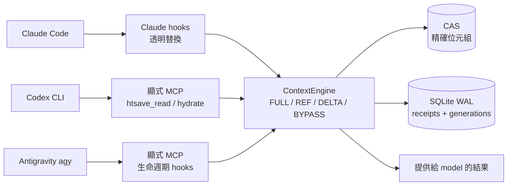

<!-- Language Switch -->
<p align="center">
  <a href="README.md">English</a> |
  <strong>🌐 繁體中文</strong>
</p>

> [!NOTE]
> 本文件為英文 README 的翻譯版本。如有出入，以 [英文版](README.md) 為準。

---

# htsave

`htsave` 1.0.0 是一個本地、確定性、無損的重複內容快取層，適用於 Claude Code、
Codex CLI 和 Antigravity agy。它將精確的 UTF-8 tool 輸出結果在每個 session 中只
儲存一次，後續可回傳已確認的參考指標或經驗證的 `unified-diff-v1` 差異。它絕不會
正規化位元組、摘要內容、執行語意/嵌入搜尋，也不會傳送遙測資料。agy 支援顯式 MCP
整合，但目前的實機節省 gate 為紅燈，不作任何節省聲明。

本套件版本為 1.0.0。剩餘的 v1 發佈驗收項目追蹤於
[docs/release-gates.md](docs/release-gates.md)；在所有驗收項目通過之前，本專案
不應被視為已完成的 v1 正式版本。

在 Claude Code 上，它能透明地節省 token：重複執行一個指令，其輸出會以參考指標
而非完整文字回傳，你的工作流程完全不需要改變。在 Codex CLI 上，只有明確使用 MCP
tools 才能節省 token，因為 Codex 目前沒有支援替換 tool 結果的方式。在 agy 上，同樣
提供顯式 MCP tools，並搭配 fail-open 生命週期 hook。

## 一眼看懂

`htsave` 在 host 邊界攔截重複內容。第一次結果以精確位元組儲存；後續結果會變成
精簡的 `REF` 或經驗證的 `DELTA`，需要時 `htsave_hydrate` 可逐字節還原原始內容。



### 支援平台矩陣

| 平台 | 安裝指令 | 提供給 model 的路徑 | 透明替換 | 目前證據 |
| :--- | :--- | :--- | :---: | :--- |
| **Claude Code** | `htsave claude install` | Shell hooks | ✅ 有 | 80/80；節省 gate 通過 |
| **Codex CLI** | `htsave codex install` | 顯式 MCP：`htsave_read` / `htsave_hydrate` | ❌ 無 | 80/80；節省 gate 通過 |
| **Antigravity agy** | `htsave agy install` | 顯式 MCP + 生命週期 hooks | ❌ 無 | 80/80；整合已安裝，節省 gate 紅燈 |

### 實際測試過的模型

下表只列出實際執行過 benchmark 的模型，不包含僅出現在預設值或測試 fixture
中的名稱。

| 模型 | Host / 路徑 | 執行數 | 實測結果 |
| :--- | :--- | ---: | :--- |
| `gpt-5.6-luna` (low) | Codex CLI / 顯式 MCP | 80/80 | ✅ 通過；節省中位數 30.43%–41.69% |
| `claude-haiku-4-5-20251001` | Claude Code / 透明 shell | 80/80 | ✅ 通過；節省中位數 92.40%–94.91% |
| `gemini-3.7-flash-low` | agy / MCP v2；v3 零 hydrate | 每次 80/80 | ⚠️ 紅燈；v2 −18.69%–26.07%，v3 −4.32%–22.80% |
| `gemini-3.1-pro-low` | agy / MCP v1；v3 零 hydrate | 每次 80/80 | ⚠️ 整體紅燈；v1 3.31%–48.44%，v3 7.02%–43.78% |
| `claude-sonnet-4-6` | agy / 顯式 MCP | 28/80 | ⏸ 部分完成、受 quota 限制；10 組完成 pair 為 2.27% |

`gpt-5.6-luna` 與 agy 模型是本次測試選用的本地 model；token 數不代表官方價格或
折扣。完整情境表、manifest 路徑與稽核說明請見 [verify.md](verify.md)。

程式中另外出現 `gpt-5.6-sol`（Codex benchmark 預設）、`claude-opus-5`
（Claude 預設／測試 fixture）及 `gpt-5`（CLI estimator／hydrate 預設）。
`claude-3-5-haiku` 是不可用的歷史 alias。這些不是實機 benchmark 證據，因此刻意
不列入上方表格。

## 安裝

支援 Python 3.11+ ，適用於 Linux、macOS 和 Windows：

```bash
uv tool install htsave

htsave claude install    # Claude Code：將 hook + MCP server + skill 安裝至 settings.json
htsave codex install     # Codex CLI：透過 managed plugin marketplace 安裝
htsave agy install       # Antigravity CLI：將 skill + MCP + hooks 安裝至 ~/.gemini/config/
htsave doctor
```

安裝與移除皆為冪等操作，且 `htsave claude install` 與 `htsave agy install` 只會
新增標記為自身所有的項目 — 你的配置中現有的 hook 和 MCP server 會被完整保留。所有
`uninstall` 指令在未提供 `--yes` 時都會預覽變更，且永遠不會移除 session 資料。`gc`
在未加 `--apply` 時為 dry-run；`clear` 在未加 `--yes` 時為 dry-run。

## Skill 指令

在 Claude Code 上，`/htsave` 會啟用 skill — 它告知 model 關於 HTSAVE/1
transport frame 以及如何在需要完整位元組時呼叫 `htsave_hydrate`。在 Codex CLI
上，`$htsave` 有相同功能。在 Antigravity CLI 上，skill 會從
`~/.gemini/config/skills/htsave/` 自動發現。

Skill 會在執行 `htsave claude install`、`htsave codex install` 和
`htsave agy install` 時自動安裝。

## 執行路徑

支援兩條資料路徑：

1. 顯式的 `htsave_read` 和 `htsave_hydrate` MCP tools。PreToolUse hook 會注入
   一次性、綁定 generation 的 capability，而 reader 會拒絕絕對路徑、workspace
   逃逸、symlink 逃逸、目錄、特殊檔案、無效 UTF-8 和無效行範圍。
2. 生命週期 hook：SessionStart、PreToolUse、PostToolUse、PreCompact、
   SubagentStart/Stop 和 Stop。它們維護 generation、receipt 和防崩潰復原狀態。

在 **Claude Code** 上，生命週期 hook 還會透過
`hookSpecificOutput.updatedToolOutput` 原地替換重複的結果。只有 model 端位元組
明確無歧義的結果才會被處理：`Bash` 在 stderr 為空且呼叫未被中斷也非圖片時的
stdout、`Read` 的檔案內容，以及單一文字的非錯誤 MCP 結果。其他一切都原封不動地
通過。請注意，Claude Code 本身已經會對未變更檔案的相同重複 `Read` 進行去重，因此
htsave 的價值在於重複的指令輸出、重複的 MCP 結果，以及重新讀取只有些微變更的
檔案。

在 **Codex CLI** 上，只有 MCP tools 能節省 token。Codex 0.148.0 的 PostToolUse
沒有提供成功的任意結果替換回應，因此 PostToolUse adapter 僅為觀察者模式：它擷取
明確的文字並回傳 `{}` 以保留原始結果。它不使用 `block`、`continue:false`、
`updatedMCPToolOutput`、transcript 解析、hosted-tool 攔截或 wire/app-server
proxy。這仍然是明確的 release gate，直到 Codex 發佈正式合約為止。

所有狀態都儲存在平台 user-data 目錄下（可用 `HTSAVE_STATE_DIR` 覆寫），以
SHA-256 session key 分隔。每個 session 有一個不可變的 CAS 和 SQLite WAL
registry。POSIX 狀態使用 `0700` 目錄和 `0600` 檔案權限；Windows 狀態限制為
當前使用者。沒有自動 GC 或跨 session 重用。

## 實機 benchmark 證據

Benchmark 已完成 Codex CLI、Claude Code 與 Antigravity agy 各 80/80 次執行
（共 240 次實機執行；每個情境各 10 組 baseline/treatment 對照）。下表的
baseline/treatment 是該情境 10 組對照的 `input_tokens` 總和；正式 gate
使用十組 pairwise 節省比例的中位數。cached input 另行記錄，不從
`input_tokens` 扣除。原始 manifest 位於量測主機的
`/tmp/htsave-live-codex-luna-v14/manifest.json`、
`/tmp/htsave-live-claude-v6/manifest.json` 與
`/tmp/htsave-live-agy-v2/manifest.json`。

| 平台 | 測試模型 | 交付路徑 | 情境 | 10 組 baseline input 總和 | 10 組 treatment input 總和 | pairwise 節省中位數 | Gate |
| :--- | :--- | :--- | :--- | ---: | ---: | ---: | :--- |
| **Codex CLI** | `gpt-5.6-luna` (low) | 顯式 MCP | `large_readme_exact` | 2,508,942 | 1,463,038 | **41.69%** | ✅ 通過 |
| **Codex CLI** | `gpt-5.6-luna` (low) | 顯式 MCP | `source_three_line_delta` | 2,801,927 | 1,777,972 | **36.57%** | ✅ 通過 |
| **Codex CLI** | `gpt-5.6-luna` (low) | 顯式 MCP | `repeated_test_output` | 2,194,297 | 1,372,861 | **39.94%** | ✅ 通過 |
| **Codex CLI** | `gpt-5.6-luna` (low) | 顯式 MCP | `multi_round_context` | 3,281,050 | 2,631,954 | **30.43%** | ✅ 通過 |
| **Claude Code** | `claude-haiku-4-5-20251001` | 透明 shell | `large_readme_exact` | 12,760 | 658 | **94.91%** | ✅ 通過 |
| **Claude Code** | `claude-haiku-4-5-20251001` | 透明 shell | `source_three_line_delta` | 13,194 | 930 | **93.22%** | ✅ 通過 |
| **Claude Code** | `claude-haiku-4-5-20251001` | 透明 shell | `repeated_test_output` | 13,076 | 890 | **93.43%** | ✅ 通過 |
| **Claude Code** | `claude-haiku-4-5-20251001` | 透明 shell | `multi_round_context` | 13,306 | 1,090 | **92.40%** | ✅ 通過 |
| **agy** | `gemini-3.7-flash-low` | 顯式 MCP | `large_readme_exact` | 765,338 | 804,254 | **−18.69%** | ❌ 紅燈 |
| **agy** | `gemini-3.7-flash-low` | 顯式 MCP | `source_three_line_delta` | 896,518 | 698,395 | **26.07%** | ❌ 紅燈 |
| **agy** | `gemini-3.7-flash-low` | 顯式 MCP | `repeated_test_output` | 782,637 | 855,713 | **−0.78%** | ❌ 紅燈 |
| **agy** | `gemini-3.7-flash-low` | 顯式 MCP | `multi_round_context` | 1,045,462 | 1,062,161 | **1.96%** | ❌ 紅燈 |

`gpt-5.6-luna` 與 `gemini-3.7-flash-low` 是各次本地選用的模型。本專案不
宣稱任何官方公開定價。Codex 與 Claude 的執行全部完成且通過 deterministic
oracle；Claude 四個節省 gate 全部達到 30%（92–95% 區間）。agy 執行也全部
完成且通過 oracle，但四個節省 gate 都未達 30%，這是有效的 red 實證結果，
不是執行失敗。對 `events.jsonl` 的逐回合鑑識（詳見 `verify.md`）把根因收斂
到 agy 的架構本身：agy 會把大型工具輸出溢出（spill）到 brain 檔案、只讓
摘要進入模型 context，加上 Gemini 伺服器端 KV cache 吸收重複內容，兩臂都
從未真正重新計費全文。因此 gate 指標（未命中快取的 `input_tokens`）由「哪
一臂抽到 KV cache 失誤」主導，pair 層級擺盪遠大於任何傳輸層效果；
`htsave_hydrate` 的全文回灌只是次要因素——v3 已透過 skill 與 PreInvocation
提醒把每次 session 的 hydrate 從 1 次降為 0 次，80/80 重跑讓
`large_readme_exact` 中位數從 −18.69% 回升到 −3.77%（+14.92 點），但其餘
情境在雜訊範圍內，四個 gate 仍全數紅燈，印證結構性結論。Claude
Code 透過 `hookSpecificOutput.updatedToolOutput` 在模型看到結果前就完成替換，
因此不受此限制；agy 目前沒有對等的 hook 合約，其節省 gate 在可預見的合約
下維持紅燈。

完整稽核清單、原始 manifest 路徑與重現指引請參閱 [verify.md](verify.md)。


## 操作指令

```text
htsave claude install|uninstall|status
htsave codex install|uninstall|status
htsave agy install|uninstall|status
htsave doctor
htsave stats [--session-key KEY]
htsave inspect [--session-key KEY]
htsave hydrate REF --session-key KEY
htsave gc [--apply]
htsave clear (--session-key KEY | --all) [--yes]
htsave benchmark run --output DIR [--host claude|codex|agy] [--path mcp|shell]
                     [--max-executions N] [--confirm-paid-runs]
htsave benchmark run --output DIR --resume [--confirm-paid-runs]
htsave benchmark report DIR/manifest.json
```

決策閾值使用 `tiktoken` 估算，並標示為估算值；它們不是帳單用量。配對 benchmark
僅從公開的 `codex exec --json` JSONL 讀取終端使用量，且需要明確提供
`--confirm-paid-runs`。

`--host` 選擇要量測的 agent CLI，`--path` 選擇交付路徑。

`claude` 為預設值，量測透明路徑：實驗組的差異僅在於該次嘗試的隔離
`CLAUDE_CONFIG_DIR` 中是否安裝了 htsave 的 hook，因此操作者自身的 hook 和 MCP
server 不會出現在任何一組中。`codex` 預設為 `mcp` 路徑，兩組都呼叫
`htsave_read`，基準組回傳原始文字；其 `shell` 路徑在啟動前就停止，因為 Codex
尚無透明替換合約。

`--max-executions N` 最多執行 N 個 slot 後停止，`--resume` 完成剩餘部分 —
先用一對證明接線正確，再為四十對付費。
詳見 [docs/architecture.md](docs/architecture.md) 和
[docs/release-gates.md](docs/release-gates.md) 以了解不變式和驗收證據。

## 開發

```bash
uv sync --extra dev
uv run pytest -q
uv run ruff check src tests
uv run htsave --json doctor
uv build
```

## 授權

htsave 採用 MIT 授權條款發佈。見 [LICENSE](LICENSE)。
